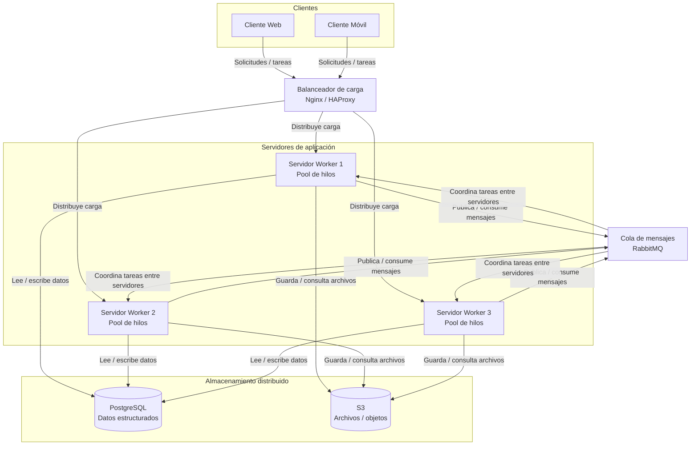

# Diagrama de arquitectura distribuida

Este diagrama representa el rediseño del sistema como una arquitectura distribuida cliente-servidor. Incluye clientes web y móviles, un balanceador de carga, servidores workers con pool de hilos, una cola de mensajes y almacenamiento distribuido.

## Explicación breve

Los clientes web y móviles envían tareas al sistema. El balanceador de carga, que puede implementarse con Nginx o HAProxy, distribuye las solicitudes entre varios servidores workers.

Cada servidor worker posee un pool de hilos, lo que permite procesar varias tareas de manera concurrente. Para la comunicación entre servidores se utiliza una cola de mensajes RabbitMQ, que ayuda a organizar las tareas y desacoplar los componentes.

El almacenamiento se divide en PostgreSQL para datos estructurados y S3 para archivos u objetos. Esta separación permite mejorar la escalabilidad, la organización y la disponibilidad del sistema.